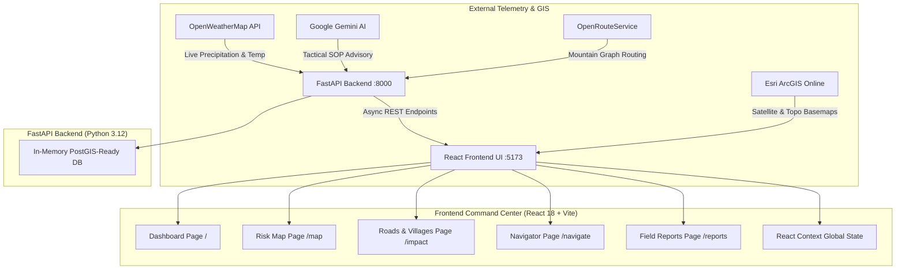

# TerraGuard NER: Landslide Intelligence & Operational Command Platform

An enterprise-grade, visual-first landslide disaster intelligence and relief routing platform specifically engineered for the steep, monsoon-vulnerable corridors of the North-East Region (NER) of India (Assam, Sikkim, Meghalaya, Manipur).

---

## 🌟 Key Capabilities

- **🗺️ Spatial GIS Multi-Layer Command Center**: 720px interactive Leaflet canvas with real-time vector overlays (Hazard zones, road blockages, isolated villages, and emergency hospitals).
- **🛰️ High-Resolution Satellite & Topo Relief**: 100% free, zero-key, watermark-free basemaps powered by **Esri World Imagery** and **Esri World Topographic Relief**.
- **🤖 Generative AI Disaster Decision Support**: Integrates **Google Gemini (`gemini-flash-latest`)** to convert multi-factor geotechnical telemetry into NDMA-standard operational advisories in real-time.
- **🌧️ Live Meteorological Ingestion**: Interfaced with **OpenWeatherMap API** to ingest live precipitation (mm/h), temperature, and humidity for monitored mountain districts.
- **🧭 Risk-Aware Mountain Convoy Routing**: Powered by **OpenRouteService (ORS)** to calculate hazard-cleared bypass routes for ambulances and relief trucks around severed corridors.
- **⚡ Decoupled Full-Stack Architecture**: Modern **React 18 (Vite) + Tailwind CSS** frontend backed by a high-concurrency **FastAPI (Python 3.12)** server with PostGIS-ready schemas.
- **🛡️ Offline Resilience**: Built-in fail-safe **NDMA Expert Rule Engine** ensuring mission-critical continuity during mountain communications blackouts.

---

## 🏗️ System Architecture



---

## 🗂️ Project Structure

```text
SIH-PS/
├── backend/
│   ├── main.py              # FastAPI server, endpoints, and microservice proxy
│   └── requirements.txt     # Python backend dependencies
├── src/
│   ├── components/
│   │   ├── common/          # TopBar, Sidebar, StatCards, PredictionBadge
│   │   ├── dashboard/       # Donut charts, population bars, trend lines, triage list
│   │   ├── map/             # Leaflet canvas, LayerControls, ZoneDetailsDrawer
│   │   ├── impact/          # RoadsTable, VillageCardGrid, isolation analytics
│   │   ├── navigator/       # RouteComparisonCards, NavigatorMap, bypass routing
│   │   └── reports/         # Incident reporting grid & verification modal
│   ├── context/
│   │   └── DisasterDataContext.jsx # Unified Geospatial Fusion Hub & Global State
│   ├── data/                # PostGIS-compatible benchmark GeoJSON catalogs
│   └── services/            # API clients for Gemini, OpenWeather, ORS, and Backend
├── .env.example             # Environment configuration template
├── package.json             # Frontend dependencies & scripts
├── tailwind.config.js       # Stone-slate visual tokens & design system
└── vite.config.js           # Vite build configuration
```

---

## 🚀 Quickstart Guide

### Prerequisites
- **Node.js**: v18.0 or higher
- **Python**: v3.10 or higher

### 1. Clone the Repository
```bash
git clone https://github.com/Mahathi1601/TerraGuard_NER.git
cd TerraGuard_NER
```

### 2. Frontend Setup
```bash
# Install npm dependencies
npm install

# Start the Vite development server
npm run dev
```
The frontend will start at **`http://localhost:5173/`**.

### 3. Backend Setup (Optional but Recommended)
Open a second terminal window:
```bash
cd backend

# Install Python requirements
pip install -r requirements.txt

# Start the FastAPI backend server
python -m uvicorn main:app --port 8000 --reload
```
The backend will run at **`http://127.0.0.1:8000/`** (Interactive Swagger documentation available at **`http://127.0.0.1:8000/docs`**).

---

## 🔑 Environment Configuration (`.env`)

Copy `.env.example` to create your local `.env` file:
```bash
cp .env.example .env
```

Fill in your API keys (the platform gracefully falls back to local simulation if any key is missing):
```env
# Local FastAPI Backend
VITE_API_BASE_URL=http://localhost:8000/api

# Google Gemini AI (Free Key: https://aistudio.google.com/)
VITE_GEMINI_API_KEY=your_gemini_key_here

# OpenWeatherMap (Free Key: https://home.openweathermap.org/api_keys)
VITE_OPENWEATHER_API_KEY=your_openweather_key_here

# OpenRouteService (Free Key: https://openrouteservice.org/dev/#/signup)
VITE_ORS_API_KEY=your_ors_key_here
```

---

## 📊 Scientific Susceptibility Model

Landslide risk probabilities ($0\%\text{ to }100\%$) are calculated following the **Geological Survey of India (GSI) National Landslide Susceptibility Mapping (NLSM)** standard:

$$\text{Hazard Risk Score} = (0.40 \times \text{Rainfall}) + (0.28 \times \text{Slope}) + (0.20 \times \text{Soil Saturation}) + (0.12 \times \text{Geology})$$

- 🔴 **Critical ($\ge 80\%$)**: Imminent slope failure; trigger Level-3 evacuation.
- 🟠 **High ($60\%\text{–}79\%$)**: Active deformation creep; crack-monitoring patrols deployed.
- 🟡 **Moderate ($40\%\text{–}59\%$)**: Elevated moisture; standby machinery alert.
- 🟢 **Low ($< 40\%$)**: Safe baseline monitoring.

---

## 👥 Contributors & Acknowledgements

- **Team**: Built for Smart India Hackathon (SIH).
- **Data Standards**: Aligned with **NDMA (National Disaster Management Authority)** Standard Operating Procedures and **GSI (Geological Survey of India)** Landslide Susceptibility Guidelines.
